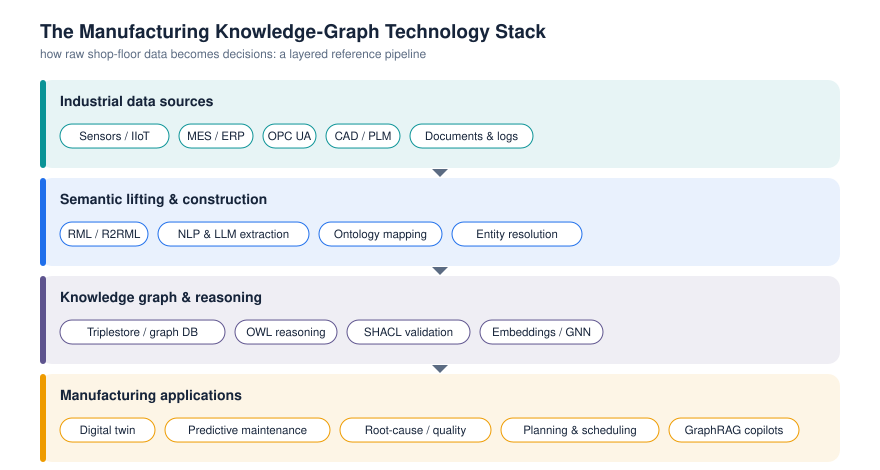
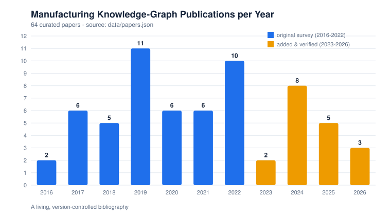
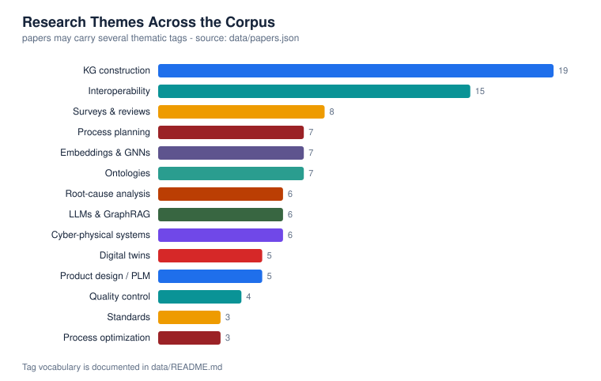

# Knowledge Graphs in Manufacturing — Literature Database, Catalogs & Benchmark

> The open, living reference for **knowledge graphs in manufacturing**: a searchable
> literature database, curated ontology/tool/standard catalogs, a taxonomy, publication-quality
> figures, and an interactive explorer — companion to (and continuously extending) our
> peer-reviewed Springer survey.

<p align="center">
  <a href="https://doi.org/10.1007/978-3-031-46452-2_4"></a>
  <a href="https://jorge-martinez-gil.github.io/knowledge-graphs-manufacturing/"></a>
  
  
  
  
  
</p>

<p align="center">
  <b>📚 <a href="https://jorge-martinez-gil.github.io/knowledge-graphs-manufacturing/">Search the literature database</a></b> ·
  <a href="BIBLIOGRAPHY.md">Full bibliography</a> ·
  <a href="catalog/ontologies.md">Ontologies</a> ·
  <a href="catalog/tools.md">Tools</a> ·
  <a href="catalog/standards.md">Standards</a> ·
  <a href="taxonomy.md">Taxonomy</a> ·
  <a href="#-cite-this-work">Cite</a>
</p>

---

This repository is research infrastructure for anyone working on **manufacturing knowledge
graphs**, **industrial knowledge graphs**, and **semantic manufacturing** — researchers,
educators, and industrial practitioners. It began as the companion to a comprehensive review
and is now a continuously updated, machine-readable knowledge base.

**What you get:**

- 🔎 **A searchable literature database** — 64 curated papers (2016–2026) as
  [JSON](data/papers.json), [CSV](data/papers.csv) and [BibTeX](data/papers.bib), explorable
  through an [interactive website](https://jorge-martinez-gil.github.io/knowledge-graphs-manufacturing/).
- 🧩 **Curated catalogs** of [manufacturing ontologies](catalog/ontologies.md) (24),
  [KG software & tools](catalog/tools.md) (33), [industrial standards](catalog/standards.md) (18),
  and [datasets](catalog/datasets.md).
- 🗺️ **A taxonomy** of the field and **publication-quality figures** you can reuse.
- 🔁 **Full reproducibility** — every derived file is regenerated from the data by a single,
  dependency-free [build script](scripts/build.py) and checked by a [validator](scripts/validate.py).

---

## Why knowledge graphs in manufacturing?

Modern factories generate vast, heterogeneous data — from sensors and IIoT devices, MES/ERP
systems, OPC UA servers, CAD/PLM tools, and unstructured documents. This data is siloed and
hard to connect. **Knowledge graphs (KGs)** represent entities (machines, products, processes,
defects, operators) and their relationships in a single, queryable, semantically-rich graph,
making manufacturing knowledge **interoperable, explainable, and machine-actionable**. In the
context of **Industry 4.0** and **Industry 5.0**, KGs underpin **digital twins**,
**cyber-physical systems**, and trustworthy industrial AI.

### What problems do they solve?

| Problem | How a manufacturing knowledge graph helps | Theme |
|---|---|---|
| Data silos across IT/OT | Integrate heterogeneous sources under a shared semantic schema | Interoperability |
| Opaque AI decisions | Provide relational context for explainable, auditable reasoning | Explainability |
| Unplanned downtime | Link assets, failure modes and history for predictive maintenance | Predictive maintenance |
| Recurring defects | Connect symptoms, causes and process steps for root-cause analysis | Quality & root-cause |
| Slow process planning | Reuse formalized process knowledge and constraints | Process planning |
| Static digital twins | Give the twin a semantic, evolvable knowledge layer | Digital twins |
| Supply disruptions | Make suppliers, parts and events traceable end-to-end | Supply chain |

See the full [taxonomy](taxonomy.md) for how these fit together.



---

## The research landscape at a glance

Publications per year across the curated corpus (2016–2026), and the dominant research themes:





A clear recent trend: the convergence of **Large Language Models with knowledge graphs**
(GraphRAG, KG-grounded reasoning) and the maturing of **cognitive digital twins** for
human-centric **Industry 5.0**. All figures are regenerated from the data by
[`scripts/build.py`](scripts/build.py).

---

## How do I… ?

### …find relevant literature
Use the **[interactive explorer](https://jorge-martinez-gil.github.io/knowledge-graphs-manufacturing/)**
to full-text search and filter by year and theme, then copy BibTeX for any paper. Prefer files?
Grab [`data/papers.bib`](data/papers.bib), [`data/papers.csv`](data/papers.csv), or read the
grouped [BIBLIOGRAPHY.md](BIBLIOGRAPHY.md).

### …compare manufacturing ontologies
Browse the [ontology catalog](catalog/ontologies.md): 24 ontologies (MASON, the Industrial
Ontologies Foundry suite, P-PSO, MSDL, SAREF4INMA, BFO, and more) with scope, license and a
verifiable source for each.

### …choose tools / triplestores
The [tools catalog](catalog/tools.md) covers 33 systems across triplestores, ontology editors,
reasoners, SHACL validation, RML/OBDA mapping, KG embeddings, query and visualization — with
licenses and links.

### …align with industrial standards
The [standards catalog](catalog/standards.md) maps RAMI 4.0, the Asset Administration Shell,
OPC UA, ISA-95/ISA-88, AutomationML, MTConnect, QIF and the W3C stack (RDF, OWL, SHACL, SPARQL,
PROV-O) to where they fit in a KG.

### …evaluate a manufacturing knowledge graph
Use the transparent **FAIR-based checklist** in [catalog/datasets.md](catalog/datasets.md). We
publish *criteria* — findability, accessibility, interoperability, reusability, scale/quality,
reasoning support, and maintenance — rather than invented rankings, so you can assess any
resource consistently and reproducibly.

### …reproduce or extend the data
```bash
git clone https://github.com/jorge-martinez-gil/knowledge-graphs-manufacturing
cd knowledge-graphs-manufacturing
python3 scripts/build.py      # regenerate CSV, BibTeX, catalogs, figures, website data
python3 scripts/validate.py   # check links, fields, tags, uniqueness, sync
```
No third-party dependencies — Python 3.8+ standard library only.

### …contribute a paper or resource
Open an issue ([add a paper](../../issues/new?template=add_paper.yml) ·
[add a resource](../../issues/new?template=add_resource.yml)) or send a pull request. See
[CONTRIBUTING.md](CONTRIBUTING.md). **Golden rule:** every entry must be verifiable, with a
resolvable link; unknown fields are left blank, never guessed.

---

## Repository structure

```
data/        Canonical datasets (papers, ontologies, tools, standards) + generated CSV/BibTeX
catalog/     Human-readable catalogs (ontologies, tools, standards, datasets)
docs/        Interactive website (GitHub Pages) — searchable literature explorer
figures/     Publication-quality SVG figures, regenerated from data
scripts/     build.py (regenerate everything) and validate.py (integrity checks)
taxonomy.md  A taxonomy of manufacturing knowledge graphs
BIBLIOGRAPHY.md  Full reading list grouped by year (generated)
```

Everything in `data/*.csv`, `data/*.bib`, `catalog/*.md`, `figures/*.svg`, `BIBLIOGRAPHY.md`
and `docs/papers.json` is **generated** — edit the JSON in `data/` and re-run the build.

---

## About the survey

This platform accompanies a peer-reviewed review of **knowledge graph adoption in
manufacturing**, surveying the field across Industry 4.0 applications, cyber-physical systems,
digital twins, process optimization, quality control, root-cause analysis and resource
allocation, and outlining open challenges (scalability, real-time updates, cross-domain
interoperability, knowledge evolution) and a research roadmap toward Industry 4.0/5.0.

> **TL;DR:** We systematically review the literature on knowledge graphs in manufacturing, map
> the research landscape, and identify open challenges — and this repository keeps that map
> current and reusable.

`Knowledge Graphs` · `Manufacturing` · `Industry 4.0` · `Industry 5.0` · `Semantic Web` ·
`Ontologies` · `Digital Twins` · `IIoT` · `Cyber-Physical Systems` · `Smart Manufacturing` ·
`Knowledge Representation` · `Industrial AI`

---

## 📚 Cite this work

If this repository or its dataset is useful in your research, please cite the survey. A
[`CITATION.cff`](CITATION.cff) is included so GitHub can generate citations automatically.

**BibTeX:**

```bibtex
@Inbook{Martinez-Gil2024,
  author    = {Martinez-Gil, Jorge and Hoch, Thomas and Pichler, Mario
               and Heinzl, Bernhard and Moser, Bernhard and Kurniawan, Kabul
               and Kiesling, Elmar and Krause, Franz},
  editor    = {Soldatos, John},
  title     = {Examining the Adoption of Knowledge Graphs in the Manufacturing Industry: A Comprehensive Review},
  booktitle = {Artificial Intelligence in Manufacturing: Enabling Intelligent, Flexible and Cost-Effective Production Through AI},
  year      = {2024},
  publisher = {Springer Nature Switzerland},
  address   = {Cham},
  pages     = {55--70},
  isbn      = {978-3-031-46452-2},
  doi       = {10.1007/978-3-031-46452-2_4},
  url       = {https://doi.org/10.1007/978-3-031-46452-2_4}
}
```

**APA:**
> Martinez-Gil, J., Hoch, T., Pichler, M., Heinzl, B., Moser, B., Kurniawan, K., Kiesling, E.,
> & Krause, F. (2024). Examining the Adoption of Knowledge Graphs in the Manufacturing
> Industry: A Comprehensive Review. In J. Soldatos (Ed.), *Artificial Intelligence in
> Manufacturing* (pp. 55–70). Springer Nature Switzerland.
> https://doi.org/10.1007/978-3-031-46452-2_4

📖 [Springer](https://doi.org/10.1007/978-3-031-46452-2_4) ·
🎓 [Google Scholar](https://scholar.google.com/citations?view_op=view_citation&hl=en&citation_for_view=X1pRUYcAAAAJ:x8G803Bi31IC)

---

## 📈 Selected research that cites this work

- **Knowledge Graph Representation Learning: A Comprehensive and Experimental Overview** —
  Sellami, Inoubli, Farah & Aridhi. *Computer Science Review*, 2025 (Elsevier).
  [link](https://www.sciencedirect.com/science/article/pii/S1574013724000996)
- **Procedural Knowledge Management in Industry 5.0: Challenges and Opportunities for Knowledge Graphs** —
  Celino, Carriero, Azzini & Baroni. *Journal of Web Semantics*, 2024 (Elsevier).
  [link](https://www.sciencedirect.com/science/article/pii/S1570826824000362)
- **From Dynamic to Evolvable Knowledge Graphs in Manufacturing: Systematic Literature Review on Learning Approaches** —
  Teern, Elgendy, Kelanti, Tammia & Päivärinta. *Semantic Web Journal*.
  [link](https://www.semantic-web-journal.net/system/files/swj3745.pdf)

---

## 👥 Authors

| Name | Affiliation |
|------|-------------|
| **Jorge Martinez-Gil** | Software Competence Center Hagenberg (SCCH), Austria |
| Thomas Hoch | Software Competence Center Hagenberg (SCCH), Austria |
| Mario Pichler | Software Competence Center Hagenberg (SCCH), Austria |
| Bernhard Heinzl | Software Competence Center Hagenberg (SCCH), Austria |
| Bernhard Moser | Software Competence Center Hagenberg (SCCH), Austria |
| Kabul Kurniawan | WU Wien, Austria |
| Elmar Kiesling | WU Wien, Austria |
| Franz Krause | Univ. Mannheim, Germany |

---

## 🤝 Contributing & license

Contributions are very welcome — see [CONTRIBUTING.md](CONTRIBUTING.md) and our
[Code of Conduct](CODE_OF_CONDUCT.md). Released under the [MIT License](LICENSE).

<p align="center"><i>If this helped your research, please ⭐ star the repository and cite the paper.</i></p>
