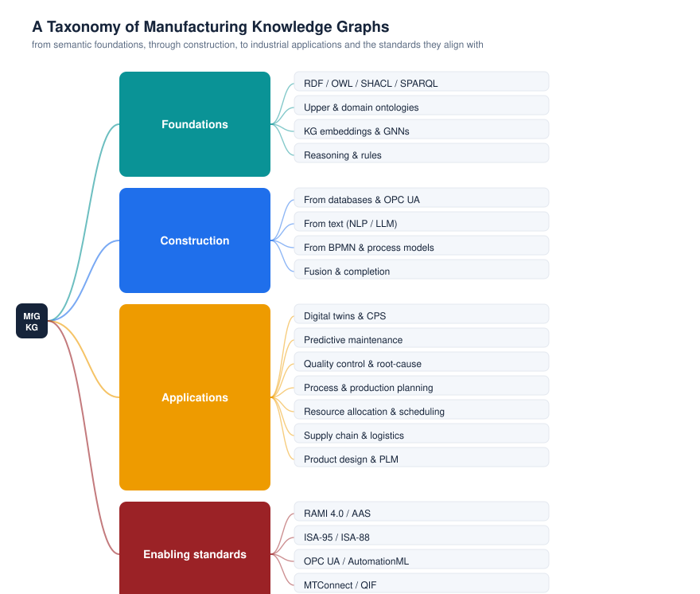

# A Taxonomy of Manufacturing Knowledge Graphs

This taxonomy organizes the field of **knowledge graphs in manufacturing** into four
layers — semantic *foundations*, graph *construction*, industrial *applications*, and the
*standards* these graphs align with. It is the conceptual backbone of this repository: every
paper in [`data/papers.json`](data/papers.json) is tagged against it, and the
[interactive explorer](https://jorge-martinez-gil.github.io/knowledge-graphs-manufacturing/)
lets you filter the literature by these categories.

## 1. Foundations

The semantic-web and machine-learning building blocks a manufacturing KG is made of.

- **Representation languages** — RDF (the triple data model), OWL (formal ontologies),
  SHACL (validation), SPARQL (query). See the [standards catalog](catalog/standards.md).
- **Ontologies** — upper ontologies (BFO, DOLCE), mid-level ontologies (IOF Core, CCO) and
  manufacturing-domain ontologies (MASON, MSDL, P-PSO). See the
  [ontology catalog](catalog/ontologies.md).
- **Embeddings & graph neural networks** — vector representations (TransE, RotatE, etc.) and
  GNNs that power link prediction, similarity and reasoning. Tagged `gnn-embedding`.
- **Reasoning & rules** — OWL reasoners and rule engines that derive implicit facts.

## 2. Construction

How a knowledge graph is actually built from heterogeneous industrial data. Tagged
`kg-construction`.

- **From structured sources** — relational databases, OPC UA information models, MES/ERP,
  via mapping languages such as R2RML/RML and OBDA (Ontop).
- **From unstructured text** — extracting entities and relations from manuals, work orders,
  maintenance logs and standards, increasingly with LLMs (`llm-rag`).
- **From process models** — lifting BPMN and engineering models into graph form.
- **Fusion & completion** — integrating multiple sources and predicting missing links.

## 3. Applications

The industrial problems manufacturing KGs solve — the part practitioners care about most.

| Application area | Tag | What the KG provides |
|---|---|---|
| Digital twins & cyber-physical systems | `digital-twin`, `cps` | A semantic, queryable model of assets and their state |
| Predictive maintenance | `predictive-maintenance` | Linked failure modes, symptoms and maintenance history |
| Quality control & root-cause analysis | `quality-control`, `root-cause` | Causal/relational context for defects and disturbances |
| Process & production planning | `process-planning` | Reusable process knowledge and constraints |
| Resource allocation & scheduling | `resource-allocation` | Capability matching and optimization context |
| Supply chain & logistics | `supply-chain` | Visibility across suppliers, parts and events |
| Product design & PLM | `product-design` | Design rules, variants and lifecycle links |

## 4. Enabling standards

The Industry 4.0 / IT–OT standards a KG aligns with so it interoperates with the rest of the
plant. Tagged `standards`, `interoperability`. See the [standards catalog](catalog/standards.md).

- **Architecture & digital-twin containers** — RAMI 4.0, Asset Administration Shell (AAS).
- **Enterprise–control & batch models** — ISA-95 (IEC 62264), ISA-88 (IEC 61512).
- **Runtime & engineering data** — OPC UA (IEC 62541), AutomationML (IEC 62714), MTConnect, QIF.

---

### Technology stack view

The same layers, read as a pipeline from shop-floor data to decisions:

---

*The taxonomy is intentionally pragmatic and will evolve with the field. Proposals to refine
it are welcome — open an issue or pull request. Figures are regenerated from the data by
[`scripts/build.py`](scripts/build.py).*
